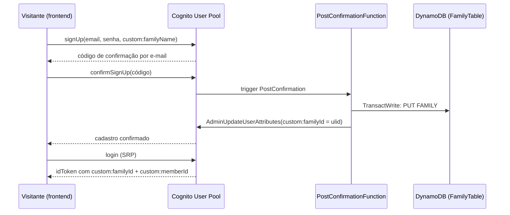

# Cadastro Self-Service de Família Design

**Spec**: `.specs/features/family-self-registration/spec.md`
**Status**: Draft

---

## Architecture Overview

O `familyId` deixa de ser um parâmetro de deploy e passa a nascer no momento da confirmação de cadastro no Cognito. Um trigger `PostConfirmation` cria a família e o membro `owner` na mesma tabela DynamoDB já existente, e grava o `familyId` de volta no usuário Cognito via `AdminUpdateUserAttributes`. Esse `familyId` passa a viajar em todo ID token (`custom:familyId`) e é conferido em todo handler que recebe `{familyId}` no path, fechando o IDOR atual.



Para os handlers de API existentes, a mudança é local por arquivo: um novo helper (`assertFamilyAccess`) substitui a leitura direta de `familyId` do path por uma leitura + comparação contra a claim do token, mantendo o resto de cada handler intacto.

Para o job diário, a mudança troca "uma única `familyPK` vinda de env var" por "todas as `familyPK` descobertas via `Scan`".

---

## Approach for the PostConfirmation trigger's IAM/Cognito wiring

Duas abordagens possíveis, ambas viáveis:

1. **Recomendada — `AWS::Lambda::Permission` explícita + ARN wildcard na policy do Lambda.** O `LambdaConfig.PostConfirmation` do `AWS::Cognito::UserPool` referencia `!GetAtt PostConfirmationFunction.Arn` (UserPool depende do Lambda). A policy do Lambda usa um padrão de ARN (`arn:aws:cognito-idp:${AWS::Region}:${AWS::AccountId}:userpool/*`) em vez de `!GetAtt FamilyUserPool.Arn`, então o Lambda **não** depende do UserPool. Um terceiro recurso, `AWS::Lambda::Permission` (Principal `cognito-idp.amazonaws.com`, `SourceArn: !GetAtt FamilyUserPool.Arn`), depende dos dois sem criar ciclo.
2. Usar o evento `Cognito` do SAM (`Events: Type: Cognito, UserPool: ...`) — mais "mágico", mas o SAM ainda precisa resolver a mesma referência cruzada por baixo dos panos e a documentação da AWS recomenda o padrão acima para `AWS::Cognito::UserPool` declarado manualmente (nosso caso, já que o User Pool já é definido como recurso raw no `template.yaml` atual).

**Por quê a (1):** referenciar `!GetAtt FamilyUserPool.Arn` diretamente na policy do Lambda criaria dependência circular (`UserPool → Lambda.Arn` e `Lambda → UserPool.Arn` ao mesmo tempo), que o CloudFormation rejeita com "Circular dependency between resources". É um problema conhecido de Cognito triggers + CFN; a wildcard + permission resource é o workaround padrão.

---

## Code Reuse Analysis

### Existing Components to Leverage

| Component                                   | Location                                  | How to Use                                                                                                    |
| ------------------------------------------- | ----------------------------------------- | ------------------------------------------------------------------------------------------------------------- |
| `familyPK`, `metadataSK`, `memberSK`        | `backend/src/lib/keys.ts`                 | Reusa direto no trigger e no job diário                                                                       |
| `ddb`, `TABLE_NAME`                         | `backend/src/lib/dynamo.ts`               | Reusa direto no trigger                                                                                       |
| `ulid()`                                    | já dependência (`ulid` no `package.json`) | Gera o novo `familyId`, mesma convenção de `taskId`/`eventId`                                                 |
| `getActingMember` / `UnlinkedAccountError`  | `backend/src/lib/auth.ts`                 | Vira a base do novo `assertFamilyAccess` (mesma forma de ler claims)                                          |
| Padrão `TransactWriteCommand`               | `backend/src/handlers/deck/decideTask.ts` | Mesmo padrão pra criar `FAMILY#`+`MEMBER#owner` atomicamente                                                  |
| `cognito.ts` (frontend)                     | `frontend/src/auth/cognito.ts`            | Mesmo padrão de `Promise`-wrap sobre `amazon-cognito-identity-js` pras novas funções `signUp`/`confirmSignUp` |
| `LoginScreen.tsx` / `SetPasswordScreen.tsx` | `frontend/src/components/`                | Mesmo estilo visual pra nova `SignUpScreen.tsx`                                                               |

### Integration Points

| System                          | Integration Method                                                                                                                                              |
| ------------------------------- | --------------------------------------------------------------------------------------------------------------------------------------------------------------- |
| Cognito User Pool               | Novo atributo custom `familyId` + `familyName` (transitório, só lido no signup) no `Schema`; `AllowAdminCreateUserOnly: false`; `LambdaConfig.PostConfirmation` |
| DynamoDB `FamilyTable`          | Trigger escreve `FAMILY#{id}/METADATA` + `FAMILY#{id}/MEMBER#owner`; job diário passa a fazer `Scan` filtrando `SK = METADATA`                                  |
| API Gateway (CognitoAuthorizer) | Nenhuma mudança — authorizer já injeta claims em `requestContext.authorizer.claims`; só o código do handler passa a validar `custom:familyId`                   |

---

## Components

### `PostConfirmationFunction` (novo)

- **Purpose**: Cria a família e o membro `owner` quando um cadastro é confirmado, e grava `custom:familyId` de volta no usuário.
- **Location**: `backend/src/handlers/auth/postConfirmation.ts`
- **Interfaces**:
  - `handler(event: PostConfirmationTriggerEvent): Promise<PostConfirmationTriggerEvent>` — assinatura exigida pelo Cognito Lambda trigger (precisa devolver o próprio `event`)
- **Dependencies**: `ddb`, `TABLE_NAME`, `ulid`, `@aws-sdk/client-cognito-identity-provider` (`AdminUpdateUserAttributesCommand`)
- **Reuses**: `familyPK`, `metadataSK`, `memberSK`, padrão `TransactWriteCommand`

### `assertFamilyAccess` (novo, em `auth.ts`)

- **Purpose**: Único ponto de checagem de que o `familyId` do path bate com o `custom:familyId` do token — substitui a leitura solta de `event.pathParameters?.familyId` em todo handler de família.
- **Location**: `backend/src/lib/auth.ts`
- **Interfaces**:
  - `assertFamilyAccess(event: APIGatewayProxyEvent, familyId: string): ActingMember` — lança `UnlinkedAccountError` se faltar `custom:memberId` ou `custom:familyId`; lança `ForbiddenFamilyError` se as famílias não baterem; devolve `{ memberId, email, familyId }` em caso de sucesso
- **Dependencies**: nenhuma nova
- **Reuses**: a leitura de claims já existente em `getActingMember` (vira uma função interna compartilhada)

### `tokenStore.ts` — `familyId` dinâmico (ajuste, não só o signup)

- **Purpose**: `frontend/src/api/client.ts` hoje monta a URL com `import.meta.env.VITE_FAMILY_ID` fixo — isso quebra assim que existir mais de uma família. O `familyId` passa a vir do `idToken` da sessão (mesmo lugar de onde já vem `memberId`), não mais de env var.
- **Location**: `frontend/src/auth/tokenStore.ts` (novo par `setFamilyId`/`getFamilyId`, mesmo padrão do `setToken`/`getToken` já existente), `frontend/src/auth/cognito.ts` (`Session.familyId` lido de `custom:familyId`), `frontend/src/auth/AuthContext.tsx` (chama `setFamilyId` em `applySession`), `frontend/src/api/client.ts` (usa `getFamilyId()` em vez de `VITE_FAMILY_ID`)
- **Dependencies**: nenhuma nova
- **Reuses**: o próprio padrão ponte `tokenStore.ts` já usado pro token

### `SignUpScreen` / `ConfirmSignUpScreen` (novos, frontend)

- **Purpose**: Formulário de cadastro (nome da família, e-mail, senha) + tela de confirmação por código.
- **Location**: `frontend/src/components/SignUpScreen.tsx`, `frontend/src/components/ConfirmSignUpScreen.tsx`
- **Interfaces**: props no mesmo estilo de `LoginScreen.tsx` (callbacks + estado local de erro/loading)
- **Dependencies**: `cognito.ts` (`signUp`, `confirmSignUp`, `resendConfirmationCode`)
- **Reuses**: mesmo tema (`theme.ts`) e estrutura visual de `LoginScreen.tsx`/`SetPasswordScreen.tsx`

---

## Data Models

### `FAMILY#{familyId}` / `SK = METADATA` (sem mudança de forma, só de origem)

```typescript
interface FamilyMetadataItem {
  PK: string; // FAMILY#{ulid}
  SK: "METADATA";
  name: string; // vem do custom:familyName informado no signup
  streak: number; // sempre 0 na criação
}
```

### `FAMILY#{familyId}` / `SK = MEMBER#owner` (sem mudança de forma)

```typescript
interface MemberItem {
  PK: string; // FAMILY#{ulid}
  SK: string; // MEMBER#owner
  memberId: "owner";
  email: string;
}
```

**Relationships**: idêntico ao modelo atual de `inviteMember.ts` — o trigger só automatiza a criação do primeiro membro.

---

## Error Handling Strategy

| Error Scenario                                                                                      | Handling                                                          | User Impact                                                                                                     |
| --------------------------------------------------------------------------------------------------- | ----------------------------------------------------------------- | --------------------------------------------------------------------------------------------------------------- |
| E-mail já cadastrado no Cognito                                                                     | Cognito recusa nativamente (`UsernameExistsException`)            | Frontend mostra "Este e-mail já está cadastrado"                                                                |
| Código de confirmação errado/expirado                                                               | Cognito recusa (`CodeMismatchException`/`ExpiredCodeException`)   | Frontend oferece "reenviar código" (`resendConfirmationCode`)                                                   |
| `TransactWriteCommand` falha no trigger (ex.: colisão de `familyId`, indisponibilidade do DynamoDB) | Trigger lança erro → Cognito não confirma o usuário               | Usuário vê erro genérico de confirmação e pode tentar de novo (novo código); nenhuma conta órfã fica confirmada |
| `familyId` do path ≠ `custom:familyId` do token                                                     | `assertFamilyAccess` lança `ForbiddenFamilyError`                 | `403` antes de qualquer leitura ao DynamoDB                                                                     |
| Token sem `custom:familyId`/`custom:memberId` (conta legada ainda não migrada)                      | `assertFamilyAccess` lança `UnlinkedAccountError` (reaproveitado) | Mesma mensagem/403 já existente hoje                                                                            |

---

## Risks & Concerns

| Concern                                                                                   | Location                                                           | Impact                                                                                                          | Mitigation                                                                                                                                           |
| ----------------------------------------------------------------------------------------- | ------------------------------------------------------------------ | --------------------------------------------------------------------------------------------------------------- | ---------------------------------------------------------------------------------------------------------------------------------------------------- |
| IDOR: hoje nenhum handler valida `familyId` do path contra o token                        | `backend/src/handlers/**/*.ts` (todos os que recebem `{familyId}`) | Qualquer conta autenticada acessa/edita dados de qualquer família                                               | `assertFamilyAccess` adicionado em todos os 10 handlers afetados (task dedicada por handler)                                                         |
| Scripts `createUser.ts`/`inviteUser.ts` só setam `custom:memberId`, não `custom:familyId` | `backend/scripts/createUser.ts`, `backend/scripts/inviteUser.ts`   | Membros convidados por esses scripts ficariam bloqueados por `assertFamilyAccess` (token sem `custom:familyId`) | Scripts passam a receber `familyId` como argumento obrigatório e setam os dois atributos                                                             |
| Circular dependency entre `AWS::Cognito::UserPool` e o novo Lambda trigger                | `backend/template.yaml`                                            | Deploy falha (`sam deploy`) se resolvido do jeito ingênuo                                                       | Ver seção "Approach for IAM/Cognito wiring" acima (ARN wildcard + `AWS::Lambda::Permission`)                                                         |
| `Scan` no job diário custa mais RCU conforme o nº de famílias cresce                      | `backend/src/handlers/jobs/generateDailyDeck.ts`                   | Job fica mais lento/caro em escala grande                                                                       | Aceito como assunção registrada na spec; se o nº de famílias crescer muito, criar um GSI dedicado (`GSI2PK = "FAMILY_INDEX"`) — fora do escopo atual |
| `seed.ts` hoje assume 1 família fixa via `FAMILY_ID` env var                              | `backend/scripts/seed.ts`                                          | Nenhum — é ferramenta de dev, não depende do parâmetro `FamilyId` do CFN que está sendo removido                | Mantido como está (fora de escopo)                                                                                                                   |

> Nenhum outro ponto de tech debt relevante encontrado nos arquivos tocados por esta feature.

---

## Tech Decisions (only non-obvious ones)

| Decision                                    | Choice                                                                                                             | Rationale                                                                                                                |
| ------------------------------------------- | ------------------------------------------------------------------------------------------------------------------ | ------------------------------------------------------------------------------------------------------------------------ |
| Geração do `familyId`                       | `ulid()` em vez de UUID v4                                                                                         | Já é dependência usada para `taskId`/`eventId`; mantém convenção única de ids no projeto                                 |
| Onde persistir `custom:familyId` no usuário | `AdminUpdateUserAttributesCommand` dentro do próprio trigger `PostConfirmation`, não `PreTokenGeneration`          | Mais simples e o valor fica permanente no usuário (não recalculado a cada token); evita um segundo trigger               |
| Autorização por família                     | Um único helper (`assertFamilyAccess`) chamado no início de cada handler, em vez de um middleware/wrapper genérico | Coerente com o estilo atual do código (funções puras por handler, sem camada de middleware); menor blast radius por task |
| Nome da família no cadastro                 | Atributo custom `custom:familyName` no signup (lido só pelo trigger, nunca persistido no Cognito além disso)       | Evita criar endpoint HTTP público extra; usa só a API do Cognito                                                         |
| Job diário: descoberta de famílias          | `Scan` com filtro `SK = METADATA`                                                                                  | Simplicidade agora; nº de famílias esperado é baixo (ver Risks & Concerns)                                               |

> **Nota:** este é o primeiro conjunto de decisões arquiteturais registrado no projeto — não há `.specs/STATE.md` ainda. Ao final desta feature, registrar como `AD-001` (multi-tenant: familyId nasce no signup, nunca é parâmetro de deploy) e `AD-002` (autorização por família via `assertFamilyAccess` em cada handler) em `.specs/STATE.md`, já que ambas viram convenção para features futuras.
